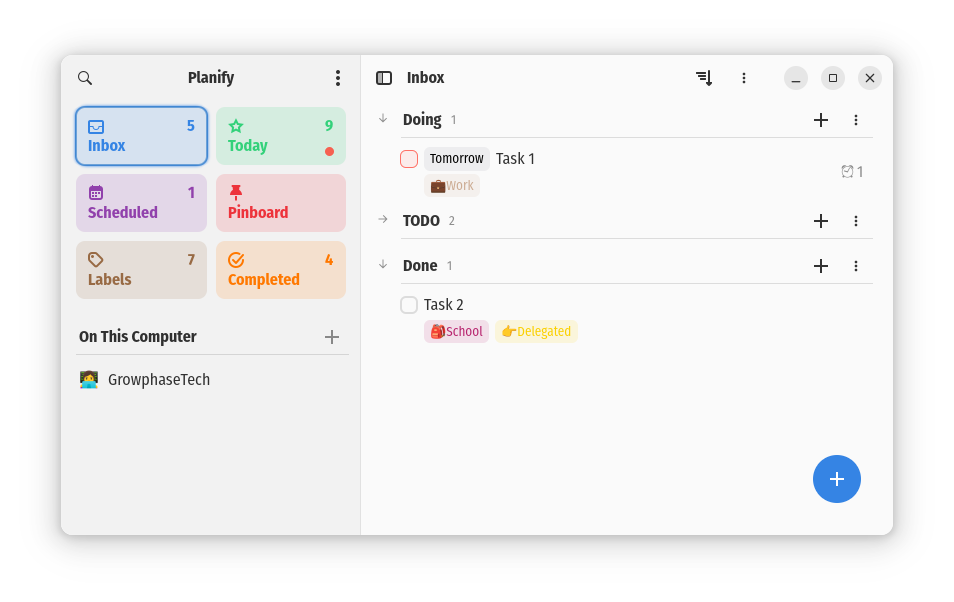

# Planify GNOME Extension

## Description

This is a GNOME tray extension for managing tasks for Planify app (https://github.com/alainm23/planify).
My current system is based on Ubuntu 22.04 with GNOME 42.9.


Since I use Flatpak to run Planify, the planify app is executed with the following command:

```bash
flatpak run com.alainm23.planify
```



To use with this extension, we will need gnome-extensions to be installed.
To install gnome-shell-extensions or gnome-shell-extension-manager, you can use the following command:

```bash
sudo apt install gnome-shell-extensions
```

or

```bash
flatpak install flathub org.gnome.Extensions
```

To install gnome-shell-extension-manager, you can use the following command:

```bash
sudo apt install gnome-shell-extension-manager
```

## Build

```bash
make all
make build
make clean
make install
make enable
make disable
make uninstall
```

## Usage

After installing the extension using `make install`, you can enable it using `make enable`.

Now you can have it reflected in the GNOME Shell System tray restarting the GNOME Shell.
You can do it using `Alt + F2` and typing `r` and pressing `Enter`.
Or you can restart the GNOME Shell, logging out and logging back in.

Note: To disable the extension, you can use `make disable`.
